# ProyectoTETRIS

[JavaDoc](https://mcunabernardez.github.io/ProyectoTETRIS/JavaDoc/index.html)
-------------------------
DIAGRAMA DE CLASES
-------------------------

---------------
DIAGRAMA DE SECUENCIA
---------------
Secuencia de intentar mover una piezaActual a la izquierda

```mermaid
sequenceDiagram
User-->>VentanaPrincipal: presiona A o flecha izquierda
VentanaPrincipal-->>Juego: el Listener avisa a la lógica que quiere moverse a la izquierda 
Juego-->>Pieza: Se puede mover piezaActual a la izquierda?
Pieza-->>Juego: Mueve piezaActual a la izquierda
Juego-->>VentanaPrincipal: Actualiza posicion de la Pieza
```

Secuencia de iniciarPartida

